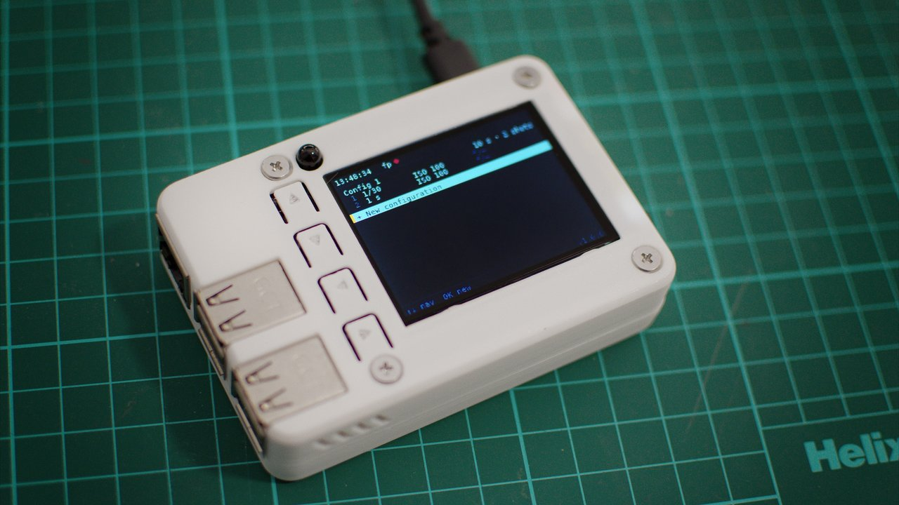

# fp-lapse



Intervalometer and timelapse controller for the **Sigma fp** camera,
running on a Raspberry Pi 3 with a 2.2" TFT and 6 buttons (Geekworm
`pitft22` HAT).

Designed as a **general-purpose timelapse tool**: simple intervals,
manual bracketing, in-flight switches between configurations without
losing the temporal grid. The headline use case is the **total solar
eclipse of August 12, 2026**.

The app boots full-screen on the Pi with no login prompt; user input is
six physical buttons. Mac-side development uses Tk-based mocks for the
display, the buttons, and the camera, so the entire UX can be exercised
without hardware.

---

## Table of contents

- [Architecture](#architecture)
- [Running on the Mac (dev)](#running-on-the-mac-dev)
- [Installing on the Pi](#installing-on-the-pi)
- [Hardware and pin map](#hardware-and-pin-map)
- [Configurations file](#configurations-file)
- [License](#license)

Three companion docs:

- **[User guide](docs/user-guide.md)** — operating the device: navigating
  the list, creating and editing configurations, running a timelapse.
- **[Functional reference](docs/reference.md)** — the exact behavior and
  data model (the source of truth the code implements).
- **[`CONTRIBUTING.md`](CONTRIBUTING.md)** — development setup, testing,
  and the Mac↔Pi deploy workflow.

---

## Architecture

Four layers, orthogonal, no circular dependencies. Each arrow is
"depends on":

```
                  ┌──────────────────────────────────┐
                  │  app.py  (orchestrator, FSM)     │
                  └──────────────┬───────────────────┘
                                 │
       ┌──────────────────────┬──┴──────────────────────┐
       │                      │                         │
       ▼                      ▼                         ▼
 ┌───────────┐         ┌──────────────┐          ┌──────────────┐
 │ scheduler │────────▶│    engine    │          │      ui      │
 │  (thread) │         │   (FSM)      │          │  (screens)   │
 └───────────┘         └──────┬───────┘          └──────────────┘
                              │
                              ▼
                       ┌─────────────┐
                       │   configs   │
                       │(data model) │
                       └─────────────┘
                              │
                              ▼
                       ┌─────────────┐
                       │   camera    │◀── camera_health (thread)
                       │ (sigma-ptpy)│
                       └─────────────┘
                              ▲
                              │
       ┌──────────────────────┴──────────────────────┐
       │      hardware layer (no dependencies)       │
       │            display  •  buttons              │
       └─────────────────────────────────────────────┘
```

### Design choices

- **Event-driven, multi-thread.** Three daemon threads under the App:
  - **`scheduler`** wakes up on each grid mark (`t0 + k·p`) via
    kernel `nanosleep` and calls `engine.tick()` from a single thread
    — engine timing is decoupled from render cost, GC pauses, and
    log rotation. Lateness on the Pi 3 is sub-millisecond.
  - **`camera_health`** retries `camera.connect()` every 5 s if the
    USB link drops, and actively probes via `camera.info()` to
    detect "silent" disconnections.
  - GPIO callbacks (gpiozero) and a per-OK `threading.Timer` for
    long-press round out the threading model. All shared state is
    guarded by `app.lock` (RLock).
- **Hardware layer dumb**: `display` and `buttons` only talk to the
  kernel and `gpiozero`. They satisfy a `Protocol`, so the real Pi
  adapters and the Tk-based Mac mocks are swappable without the rest
  of the system noticing.
- **`camera` isolated**: all PTP / `sigma-ptpy` ugliness lives behind
  a small façade (`Camera` Protocol) with internal locking. If the
  underlying library changes, the change is local.
- **`configs` is pure data**: `Shot` and `TimelapseConfig` are frozen
  dataclasses; `ConfigStore` handles atomic JSON persistence and
  corruption rescue.
- **`engine` is a state machine** that the scheduler thread ticks at
  each grid mark. Manual configs fire N shots with `ExposureMode=Manual`
  set per shot; auto configs fire one shot with `ExposureMode=ProgramAuto`.
- **`ui` is pure rendering**: each screen takes a state snapshot
  (`UIState`, `EditState`, …) and produces a `PIL.Image` 320×240.
  Button events are translated to high-level actions
  (`MainAction.START`, `EditAction.SAVE`, …) by per-screen
  interaction classes.
- **`app.py` is the orchestrator**: it owns the screen state machine
  (MAIN / EDIT / MANAGE + four overlays: STOP, SAVE, DISCARD,
  DELETE), wires button events to the right interaction class, and
  dispatches actions through the scheduler.

### File layout

```
fp-lapse/
├── README.md
├── CONTRIBUTING.md
├── CHANGELOG.md
├── pyproject.toml              # uv-driven, pi extras opt-in
├── uv.lock
├── .python-version
├── runtime/                    # logs + configs.json (gitignored)
├── systemd/
│   └── fp-lapse.service        # production autostart
├── docs/
│   ├── user-guide.md           # operating the device (end users)
│   ├── reference.md            # functional spec + data model (source of truth)
│   └── mockups/                # 320×240 PNG mockups + render_mockups.py
├── Makefile                    # `make help` lists the common workflow shortcuts
├── scripts/                    # dev / hardware helper scripts
│   ├── e2e_smoke.py            # E2E test against the running service
│   ├── check_camera.py         # manual Sigma fp adapter validation
│   ├── demo_display.py         # Tk mock display smoke test
│   └── demo_buttons.py         # Tk mock buttons smoke test
├── src/
│   └── fp_lapse/
│       ├── __init__.py
│       ├── __main__.py         # `python -m fp_lapse` entry point
│       ├── app.py              # screen FSM + dispatcher
│       ├── config.py           # paths, constants
│       ├── configs.py          # Shot, TimelapseConfig, ConfigStore
│       ├── engine.py           # IDLE/RUNNING state machine
│       ├── engine_scheduler.py # daemon thread that wakes the engine on time
│       ├── camera_health.py    # daemon thread that auto-reconnects the fp
│       ├── control_server.py   # localhost HTTP API for autonomous testing
│       ├── shutter.py          # shutter parse/format/range
│       ├── logging_setup.py
│       ├── _compat.py          # collections.abc shim for old `construct`
│       ├── camera/             # iface, MockCamera, SigmaFpCamera
│       ├── buttons/            # iface, FakeButtonPanel, TkButtonPanel, GpioButtonPanel
│       ├── display/            # iface, InMemoryDisplay, TkDisplay, Framebuffer
│       └── ui/
│           ├── theme.py        # palette + spacing constants
│           ├── fonts.py        # cross-platform font loader
│           ├── widgets.py      # status bar, footer, banner, config block, shot row
│           ├── main_screen.py  # MainScreen + MainScreenInteraction
│           ├── edit_screen.py  # EditScreen + EditScreenInteraction
│           ├── edit_values.py  # discrete value lists for cycling
│           ├── overlays.py     # confirmation modal dialogs
│           └── manage_menu.py  # Edit / Duplicate / Delete / Cancel
└── tests/                      # one test_X.py per src module
```

### Main loop sketch

```python
display = TkDisplay() if mock else Framebuffer()
buttons = TkButtonPanel() if mock else GpioButtonPanel.create()
camera  = MockCamera() if mock else SigmaFpCamera()
store   = ConfigStore(CONFIGS_FILE)
engine  = Engine(camera)

dirty_event = threading.Event()
scheduler   = EngineScheduler(engine, dirty_event=dirty_event)
app         = App(scheduler=scheduler, store=store, camera=camera)
router      = ButtonRouter(app=app, dirty_event=dirty_event)
router.attach(buttons)

scheduler.start()
CameraHealth(camera, dirty_event=dirty_event).start()

# UI thread (main): block until something changes or 250 ms elapses
# (so the seconds-to-next-shot decimals keep updating), then render.
while not shutdown:
    dirty_event.wait(timeout=0.250)
    dirty_event.clear()
    display.blit(app.render())
```

---

## Running on the Mac (dev)

The Mac is the primary development environment. The Pi is for hardware
testing only. All UI flows (navigation, editing, manage menu, overlays)
can be exercised on the Mac through the Tk mocks.

This project uses **`uv`** for dependency management.

```bash
brew install uv
uv sync                # creates .venv/, installs locked deps
uv run fp-lapse        # opens the Tk window with the mock display
```

`uv run python -m fp_lapse` is equivalent. `FP_LAPSE_MOCK=1` forces
mock mode even on Linux.

Keyboard mapping (Tk mock buttons):

| Key            | Button          |
|----------------|-----------------|
| Arrow Up       | UP              |
| Arrow Down     | DOWN            |
| Arrow Left     | LEFT            |
| Arrow Right    | RIGHT           |
| Enter / Return | OK              |
| Escape         | BACK            |

Hold Enter for ≥3 s on a config to open the manage menu (Edit /
Duplicate / Delete / Cancel).

Run the test suite:

```bash
uv run python -m unittest discover -s tests
```

---

## Installing on the Pi

The **from-scratch** setup for a Raspberry Pi 3 + Geekworm `pitft22`
HAT. Done once, by hand. Tested on **Raspberry Pi OS Lite, 32-bit,
Trixie** (Debian 13, Python 3.13).

> Why Lite 32-bit? Lite has no desktop, so the app owns the framebuffer
> directly. 32-bit (`armv7l`) matches the prebuilt `piwheels` wheels the
> lockfile pins for the Pi 3. Pick the current **Raspberry Pi OS Lite
> (32-bit)** — not a "Legacy" image.

### 0. Flash the SD card with Raspberry Pi Imager

[Raspberry Pi Imager](https://www.raspberrypi.com/software/) runs on
Windows, macOS, and Linux — use it whatever your computer is.

1. **Choose OS** → *Raspberry Pi OS (other)* → **Raspberry Pi OS Lite
   (32-bit)**.
2. **Choose storage** → your SD card.
3. **Edit settings** (the gear / "Edit Settings" button) — this is what
   makes the Pi reachable headless on first boot:
   - **General**: set a hostname (e.g. `fp-lapse`); set the **username
     `pi`** and a password; fill in your **Wi-Fi** SSID/password and
     **country**; set locale/timezone.
   - **Services**: enable **SSH** → *Allow public-key authentication
     only* → paste your computer's public key
     (`cat ~/.ssh/id_ed25519.pub`).
4. **Write**, then put the SD in the Pi and power it on.

> Keeping the username `pi` makes the paths in
> `systemd/fp-lapse.service` (`/home/pi/fp-lapse`) correct as-is. Pick a
> different user and you'll edit those two lines.

### 1. Connect over SSH from your computer

With SSH and your key baked in by the Imager, the Pi is reachable on
first boot. Add an alias to your `~/.ssh/config` (the Makefile uses
`pi3` by default):

```
Host pi3
    HostName fp-lapse.local      # the hostname you set, or the Pi's IP
    User pi
    IdentityFile ~/.ssh/id_ed25519
```

```bash
ssh pi3        # should log straight in, no password
```

All the steps below run **on the Pi**, over that SSH session.

### 2. System packages

```bash
sudo apt update
sudo apt install -y \
    git python3-pip python3-venv \
    libopenblas0 libopenjp2-7 libtiff6 \
    fonts-dejavu-core
```

- `git` — `uv` uses it to fetch `sigma-ptpy` from GitHub.
- `libopenblas0` — the prebuilt numpy wheel links against it at runtime.
- `libopenjp2-7`, `libtiff6` — shared libraries the Pillow wheel needs
  at runtime.
- `fonts-dejavu-core` — provides `DejaVuSansMono`, the UI's fallback
  font when Menlo isn't available.

(numpy and Pillow come into the venv prebuilt from piwheels in §6, so
the `python3-numpy` / `python3-pil` system packages aren't needed.)

### 3. Enable the display (SPI + pitft22 overlay)

The Geekworm 2.2" TFT is driven by a **device-tree overlay** built into
Raspberry Pi OS — there is no driver to compile. Enable SPI and load
the overlay by appending to `/boot/firmware/config.txt` (under the
final `[all]` section):

```ini
dtparam=spi=on
dtoverlay=pitft22,speed=80000000,rotate=270,fps=60
```

`rotate=270` gives the 320×240 landscape orientation the UI expects.
The `no spi_device_id for ilitek,ili9340` warning at boot is benign.

> ⚠️ Back it up first
> (`sudo cp /boot/firmware/config.txt /boot/firmware/config.txt.bak`).
> A malformed `config.txt` can stop the Pi from booting.

### 4. User permissions (so you don't need `sudo` everywhere)

```bash
sudo usermod -aG gpio,video,dialout,plugdev $USER
# log out / back in for the change to take effect
```

- `gpio`: read buttons without root.
- `video`: write to the panel framebuffer (`/dev/fb*`).
- `dialout` + `plugdev`: USB access to the Sigma fp.

(The systemd service runs as root, so this only matters for running the
app manually as your user.)

### 5. Get the code onto the Pi

For a fresh install, clone the repo into `~/fp-lapse`:

```bash
git clone https://github.com/jahurtado/fp-lapse.git ~/fp-lapse
```

(For ongoing development from your computer, `make ship` rsyncs your
working tree instead — see §8.)

### 6. Install uv and create the venv

```bash
curl -LsSf https://astral.sh/uv/install.sh | sh
cd ~/fp-lapse
uv sync --extra pi    # adds sigma-ptpy, gpiozero, lgpio
```

The `pi` extra pulls the hardware-only dependencies. `sigma-ptpy` comes
from the [`makanikai/sigma-ptpy`](https://github.com/makanikai/sigma-ptpy)
GitHub repo (not on PyPI); `numpy` and `Pillow` come prebuilt from
piwheels. Internet is needed **at this step only** — the app runs fully
offline.

### 7. Boot directly into the app, full-screen, no login

The Pi should boot **straight into the app**, taking over the entire
TFT, with no TTY visible behind it.

**a. Divert the TTY off the framebuffer** — append to
`/boot/firmware/cmdline.txt` (everything stays on a single line):

```
fbcon=map:0 quiet loglevel=3 vt.global_cursor_default=0
```

`fbcon=map:0` pins the text console to `/dev/fb0` so it never lands on
the panel — on Trixie the panel is `/dev/fb1` (a firmware framebuffer
takes fb0, then drops it headless, and the console falls back to a
dummy device instead of the TFT). The rest silences the boot.

> ⚠️ Back it up first (`sudo cp /boot/firmware/cmdline.txt
> /boot/firmware/cmdline.txt.bak`). A malformed cmdline leaves the Pi
> unbootable and the only fix is pulling the SD card.

**b. Install and enable the systemd unit:**

```bash
sudo cp ~/fp-lapse/systemd/fp-lapse.service /etc/systemd/system/
sudo systemctl daemon-reload
sudo systemctl enable --now fp-lapse
sudo reboot
```

**c. Do not enable auto-login** — not needed. The service runs as root
independently of any user session; SSH keeps working normally.

After the reboot the TFT lights up showing the app (no boot messages or
blinking cursor). The service sets `Environment=FP_LAPSE_CONTROL=1`,
opening a localhost-only HTTP control surface on port 9999 for
autonomous testing — see `src/fp_lapse/control_server.py` and the `make
state` / `make frame` targets.

### 8. Common workflow (Makefile)

From your computer, with `pi3` set up in `~/.ssh/config` (§1), the
Makefile wraps the routine commands:

```bash
make             # list all targets
make test        # full unittest suite locally
make run         # launch with Tk mocks + control server
make ship        # deploy (rsync) + restart + status
make logs        # follow journalctl on the Pi
make state       # GET /state from the running app
make frame       # save and open the current 320×240 frame
make e2e         # end-to-end smoke against the running service
```

`make ship` is the typical loop after editing code. After a version
bump in `pyproject.toml`, also run `make sync` so the Pi's installed
package metadata refreshes (otherwise `importlib.metadata` reports the
old version).

### 9. Field setup — register your phone hotspot as a fallback Wi-Fi

Trixie ships **NetworkManager**, which supports multiple stored Wi-Fi
profiles and auto-connects to whichever is in range. The scheduled-
configurations feature relies on a one-time NTP sync at boot (the Pi
has no RTC), so when you take the rig out to the field — far from your
home network — you want the Pi to associate with your phone's hotspot
without anyone touching a config file.

Register the hotspot once, over SSH:

```bash
ssh pi3 'sudo nmcli connection add \
    type wifi ifname wlan0 \
    con-name "iphone-hotspot" \
    ssid "Your-Hotspot-SSID" \
    wifi-sec.key-mgmt wpa-psk \
    wifi-sec.psk "your-hotspot-password" \
    connection.autoconnect yes \
    connection.autoconnect-priority 10'
```

A few notes:

- `con-name` is the local label; `ssid` is what the phone broadcasts.
- `connection.autoconnect-priority` only matters when **both** the
  home Wi-Fi and the hotspot are in range simultaneously — higher
  value wins. In the field only the hotspot is around, so any value
  works; pick one that reflects your preference.
- Confirm what's registered: `ssh pi3 'nmcli connection show'`.
- Delete an entry by name: `ssh pi3 'sudo nmcli connection delete iphone-hotspot'`.

That's the whole setup. The scheduling feature surfaces its own
clock-sync state in the status bar (colored dot next to the clock
glyph) and offers a `TIME SETUP` menu (LEFT button on the main
screen) so you can force a re-sync or set the time manually if no
network is available — see `docs/reference.md` for the operator-facing
flow.

---

## Hardware and pin map

### TFT (HAT pitft22)

Geekworm 2.2" LCD HAT (ILI9340 controller). Manufacturer wiki:
<https://wiki.geekworm.com/2.2_LCD>.

| Function      | GPIO BCM |
|---------------|----------|
| SPI0 SCLK     | 11       |
| SPI0 MOSI     | 10       |
| SPI0 MISO     | 9        |
| SPI0 CS0      | 8        |
| SPI0 CS1      | 7        |
| TFT DC        | 25       |

**Framebuffer:** 320×240, RGB565 little-endian, set up by
`dtoverlay=pitft22,speed=80000000,rotate=270,fps=60` in
`/boot/firmware/config.txt`. The panel comes up as `/dev/fb1` on Trixie
(`/dev/fb0` on Bookworm); the app finds it by driver name, so the index
doesn't matter. **Do not touch `config.txt`** without discussing it
first; what's there works.

The `no spi_device_id for ilitek,ili9340` warning at boot is benign;
ignore it.

### Buttons (6, active-low with internal pull-up)

| Button                        | GPIO BCM | Role (provisional) |
|-------------------------------|----------|--------------------|
| D-pad — top                   | 23       | UP                 |
| D-pad — opposite the top      | 22       | DOWN               |
| D-pad — left                  | 24       | LEFT               |
| D-pad — right                 | 5        | RIGHT              |
| Side — upper                  | 17       | BACK / MENU        |
| Side — lower                  | 4        | OK / SELECT        |

Mechanical bounce observed → 50 ms software debounce (`gpiozero`
`bounce_time=0.05`). Functional assignment confirmed in-app.

### Buzzer

Reserved as a future addition. Any free GPIO would work; avoid 4, 5,
7, 8, 9, 10, 11, 17, 22, 23, 24, 25 (used by TFT + buttons). The
engine accepts an optional `BuzzerLike` in its constructor; if
provided, it beeps on capture failures.

### Camera

Sigma fp over USB. Must be in **USB Mode → Camera Control** in its
menu. Standard PTP; controlled via
[`sigma-ptpy`](https://github.com/makanikai/sigma-ptpy).

### Enclosure (3D-printed case)

The unit is housed in a purpose-designed 3D-printed case, **"Malolos"**,
that fits the Raspberry Pi 3 Model B together with the 2.2" TFT and the
six buttons. Print files and assembly are published on Printables:
<https://www.printables.com/model/1733684-malolos-raspberry-pi-3-model-b-with-22-6-buttons-l>

---

## Configurations file

The app keeps the full list of timelapse configurations in a single
JSON: `runtime/configs.json`. Schema (also documented in
[`docs/reference.md`](docs/reference.md) §3.2):

```json
{
  "version": 1,
  "configs": [
    {
      "name": "Partial",
      "interval_s": 10,
      "shots": [
        { "shutter": "1/1000", "iso": 200, "aperture": null }
      ]
    },
    {
      "name": "Totality",
      "interval_s": 5,
      "shots": [
        { "shutter": "1/500", "iso": 400,  "aperture": null },
        { "shutter": "1/125", "iso": 400,  "aperture": null },
        { "shutter": "1/30",  "iso": 400,  "aperture": null },
        { "shutter": "1/8",   "iso": 400,  "aperture": null },
        { "shutter": 2,       "iso": 1600, "aperture": null }
      ]
    },
    {
      "name": "Auto day",
      "interval_s": 30,
      "shots": []
    }
  ]
}
```

Each config is either **manual** (1..9 explicit `Shot`s with
shutter+iso required and optional aperture) or **auto**
(`shots: []`, the camera meters every shot with `ExposureMode=
ProgramAuto`). The auto mode shows up in the UI as `Shots: 1 (auto)`.

Per-parameter sentinels (the old `"auto"` and `null` for individual
shots) are **not** part of the schema — auto is a config-level
decision. `aperture` may still be `null` to mean "manual lens, no
electronic aperture control".

The file is written atomically (`.tmp` + rename) with a rotating
backup at `<file>.bak`. If it becomes unparseable, the app renames
it to `<file>.bak.<timestamp>` and starts empty (the user sees a
`CONFIGS RESET` banner).

The file is plain JSON and can be edited externally over SSH:

```bash
ssh pi3 vim ~/fp-lapse/runtime/configs.json
ssh pi3 sudo systemctl restart fp-lapse
```

The app only reads it at startup.

---

## License

Released under the [MIT License](LICENSE) — free to use, modify, and
redistribute, including commercially, as long as the copyright notice is
kept. Donated to the community; contributions welcome.
